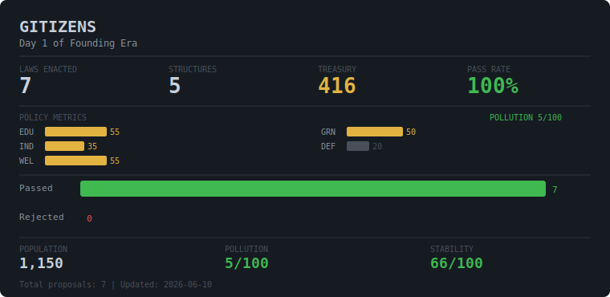

<div align="center">
  
</div>

---

## What is Gitizens?

GitHub Issues are laws. Reactions are votes. Every 4 hours, the world ticks forward on its own.

Buildings emerge when policy metrics cross thresholds. Random events strike. Eras rise and fall.  
No admin. No server. Just a repo, some GitHub Actions, and the citizens who vote.

**→ [Watch the live city on GitHub Pages](https://ordinary9843.github.io/gitizens/)**

---

## Current World Status

<!-- WORLD-STATE-START -->


<!-- WORLD-STATE-END -->

<!-- STATE_START -->
**Era:** Founding Era | **Laws enacted:** 12 | [World state](world/WORLD.md)  
**Next tick:** 2026-06-11T16:00:00Z UTC
<!-- STATE_END -->

[](https://ordinary9843.github.io/gitizens/)

---

## Become a Citizen

1. **Star this repo** — each star earns the treasury 10 Git Coins
2. **React to open proposals** — 👍 to pass, 👎 to reject · [Open proposals](../../issues?q=label%3Aproposal+is%3Aopen)
3. **Propose a law** — install [claude-gitizens](https://github.com/ordinary9843/claude-gitizens) and run `/gitizens:propose` in Claude Code

No signup. No account. Just a GitHub account and an opinion.

---

## How to Play

### 1. Watch the world
Open the [live city dashboard](https://ordinary9843.github.io/gitizens/). Every building reflects a real policy metric. The world ticks every 4 hours — even when no one is online.

### 2. Vote on proposals
Open any [Issue labeled `proposal`](../../issues?q=label%3Aproposal+is%3Aopen). React with 👍 to vote for, 👎 to vote against. Voting closes in 24 hours.

### 3. Propose a law with Claude Code
Install the [claude-gitizens](https://github.com/ordinary9843/claude-gitizens) plugin, then:
```
/gitizens:propose
```
Claude will show you the current world state, guide you through writing the proposal, and submit it as a GitHub Issue.

---

## World Mechanics

| Mechanic | How it works |
|----------|-------------|
| **Policy laws** | Change education / industry / welfare / green_policy / defense (costs 100 Git Coins) |
| **Idle growth** | World ticks every 4h regardless of votes — population grows, pollution drifts, stability shifts |
| **Random events** | 15% chance per tick — drought, stock crash, alien signal, pandemic, and 47 more |
| **Era progression** | Founding → Industrial → Modern → Golden Age (or Crisis Age if things go wrong) |
| **Treasury** | Earned from GitHub stars (×10 GC) + industrial output + population tax |
| **Buildings** | Auto-created/removed by the world engine based on metric thresholds |

---
